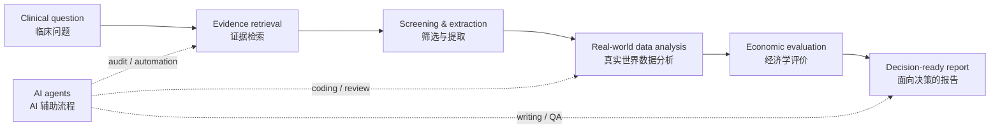

# HiroHsiang

### Health technology assessment | Real-world evidence | AI-assisted research workflows

 

  

I work on health economics, evidence synthesis, target trial emulation, and research workflow automation.  
我关注卫生技术评估、真实世界研究、证据综合与 AI 辅助科研工作流。

My current focus is building reproducible systems that connect clinical evidence, real-world data, and AI agents for clearer research and decision-making.  
我正在构建更可复现、可审计、可复用的研究系统，让临床证据、真实世界数据与 AI agents 更好地服务研究和决策。

---

## Profile Snapshot / 个人概览

| Area | Current Focus | 中文说明 |
|---|---|---|
| Research domain | Health technology assessment, pharmacoeconomics, real-world evidence | 卫生技术评估、药物经济学、真实世界证据 |
| Method stack | CEA, TTE, IPTW/IPCW, CCW, MAIC/STC, systematic review | 成本效果分析、目标试验模拟、因果推断、间接比较、系统综述 |
| Automation layer | Claude Code, Codex, Obsidian, Zotero, GitHub, reproducible ledgers | 用 AI 工具和知识库搭建可追踪的科研流程 |
| Main language | R for analysis and modeling; Markdown for research infrastructure | 主要用 R 做分析建模，用 Markdown 组织研究系统 |
| Working style | Traceable assumptions, auditable workflows, human-reviewed AI assistance | 假设可追踪、流程可审计、AI 输出有人类复核 |

---

## About Me / 关于我

- I am a health technology assessment researcher focused on clinical and economic evaluation.  
  我是一名关注临床与经济学评价的卫生技术评估研究者。

- I work across pharmacoeconomics, real-world data analysis, evidence synthesis, and decision-oriented health research.  
  我的工作横跨药物经济学、真实世界数据分析、证据综合和面向决策的卫生研究。

- I build AI-assisted workflows for literature review, data analysis, scientific writing, and reproducible project management.  
  我会构建 AI 辅助的文献综述、数据分析、科学写作和可复现项目管理流程。

- I care about making research workflows more transparent, reusable, and easier to audit.  
  我关心的是让科研流程更透明、更可复用，也更容易被检查和复核。

---

## Research Focus / 研究方向

| Focus Area | What I Work On | 中文说明 |
|---|---|---|
| Evidence synthesis | Systematic review workflows, literature screening, extraction, PRISMA-style documentation | 系统综述流程、文献筛选、数据提取、PRISMA 式文档化 |
| Health economics | Cost-effectiveness analysis, model adaptation, post-market evaluation, HTA reporting | 成本效果分析、模型迁移、上市后评价、HTA 报告 |
| Real-world evidence | Claims data analysis, target trial emulation, IPTW/IPCW, clone-censor-weight methods | 医保理赔数据分析、目标试验模拟、IPTW/IPCW、克隆-删失-加权 |
| Indirect comparison | MAIC, STC, simulation studies, and method choice in HTA decision contexts | MAIC、STC、仿真研究，以及 HTA 场景下的方法选择 |
| AI for research | Skill bundles, agent workflows, Obsidian-based knowledge systems, reproducible handoffs | AI skill、agent 工作流、Obsidian 知识系统、可复现交接记录 |

---

## Evidence Workflow / 证据工作流

---

## Featured Projects / 项目

| Project | Description | 中文说明 |
|---|---|---|
| [CCW_Claude_Skill](https://github.com/HiroHsiang/CCW_Claude_Skill) | Claude Code skill for clone-censor-weight analysis in target trial emulations. | 用于目标试验模拟中 CCW 分析的 Claude Code skill，覆盖 R 模板、权重诊断和结果报告。 |
| `PHD_data` | Research data and analysis infrastructure supporting doctoral work on indirect treatment comparison and HTA decision impact. | 支撑博士阶段间接比较、HTA 决策影响与仿真研究的数据和分析基础设施。 |
| `TTE_CEA_GLP1RA` | Target trial emulation and real-world cost-effectiveness analysis comparing GLP-1RA and SGLT2i strategies. | 基于真实世界数据比较 GLP-1RA 与 SGLT2i 策略的目标试验模拟与成本效果分析项目。 |
| `cccea` | AI-agent skill/plugin system for cost-effectiveness analysis and HTA workflows. | 面向 CEA 与 HTA 的 AI-agent skill/plugin 系统，强调 R 模板、方法学 gate 与可复现交接。 |
| `AI-PP Systematic Review` | PRISMA-oriented review on generative AI use by patients and patient-physician relationships. | 关于患者使用生成式 AI 及其对医患关系影响的 PRISMA 导向系统综述。 |

---

## Tech Stack / 技术栈

| Layer | Tools / Methods | 中文说明 |
|---|---|---|
| Analysis | R, survival analysis, CEA, simulation, claims data workflows | R 分析、生存分析、成本效果分析、仿真、医保数据流程 |
| Research data | MySQL, structured extraction, versioned outputs, reproducible tables | MySQL、结构化提取、版本化输出、可复现表格 |
| Knowledge system | Obsidian, Markdown, Zotero, project MOCs, literature notes | Obsidian、Markdown、Zotero、项目 MOC、文献笔记 |
| AI workflow | Claude Code, Codex, reusable skills, subagent handoffs, audit ledgers | Claude Code、Codex、可复用技能、subagent 交接、审计式 ledger |
| Reporting | CHEERS-style reporting, PRISMA workflows, scientific writing support | CHEERS 式报告、PRISMA 流程、科学写作辅助 |

---

## GitHub Stats / GitHub 状态

---

## Current Work / 当前方向

| Track | Direction | 中文说明 |
|---|---|---|
| AI-assisted HTA | Refining agent workflows for CEA modeling, evidence review, and report generation | 优化用于 CEA 建模、证据综述和报告生成的 agent 工作流 |
| Real-world evaluation | Connecting clinical effectiveness analysis with cost-effectiveness in claims data | 在医保理赔数据中连接临床有效性与成本效果分析 |
| Research skills | Building reusable workflows for TTE design, CCW analysis, CEA, and scientific writing | 建设可复用的 TTE、CCW、CEA 与科学写作工作流 |
| Knowledge infrastructure | Turning notes, projects, references, and outputs into a more reliable research system | 把笔记、项目、文献和产出组织成更可靠的研究系统 |

---

## Working Principle / 工作原则

Make research workflows reproducible, intelligent, and useful for real decisions.  
让科研工作流更可复现、更智能，并真正服务于决策。
